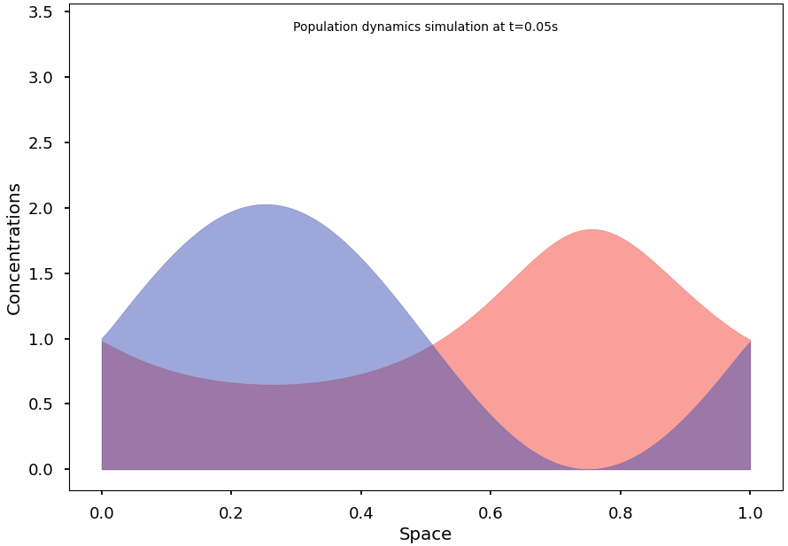

# PySpecies

Blazing-fast simulation of advanced 1D population dynamics, based on the Sheguesada Kawazaki Teramoto (SKT) model. [[Theory (French)]](./misc/theory.pdf)


## Quickstart

You will find some examples in this [Jupyter Notebook](./src/Basic-Usage.ipynb).

For example, the following code computes a blow-off solution to the SKT model:
```python
import numpy as np
from pyspecies import pop, models

q = pop.Pop(
    space = (0, 1, 200),   # we need more points
    u0 = lambda x: 1 + np.cos(2*np.pi*x),
    v0 = lambda x: 1 + np.sin(2*np.pi*x),
    model = models.SKT(
        D=np.array([[1, 0, 1], [1e-3, 0, 0]]),
        R=np.array([[4, 2, 0], [1, 1, 0]])
    )
)

q.sim(duration=0.1, N=200)
q.sim(duration=2.4, N=200)
q.anim()
```

And this renders a cyclic solution of the Lotka-Volterra equations:
```python
p = pop.Pop(
    space = (0, 1, 10),      # lower bound, upper bound, number of points
    u0 = lambda x: 1 + 0*x,  # IC for prey
    v0 = lambda x: 1 + 0*x,  # IC for predator
    model = models.LV(1.1, 0.4, 0.4, 0.1)
)

p.sim(duration=20, N=200)
p.sim(duration=100, N=200)

p.anim()
```
